<!-- README.md is generated from README.Rmd. Please edit that file -->

# veganomics

<!-- badges: start -->
<!-- badges: end -->

The goal of veganomics is to provide extra functions for using vegan
with -omics data such as RNA-Seq or microarrays, including functions
for:

- Filtering, normalizing and scaling expression matrices for use with
  rda()
- Improved plotting of variance partioning between
  constrained/non-constrained components from rda()
- Improved plotting of study design and sample strain from rda()

Some functions also work for cca()

## Installation

You can install the development version of veganomics from
[GitHub](https://github.com/) with:

``` r
# install.packages("devtools")
devtools::install_github("MalteThodberg/veganomics")
```

## Examples using Bioconductor datasets

The following includes some example analysis using various datasets from
Bioconductor.

``` r
library(veganomics)
#> Loading required package: ggplot2
#> Loading required package: patchwork
#> Loading required package: vegan
#> Loading required package: permute
#> Loading required package: lattice
#> This is vegan 2.6-4
theme_set(theme_bw())
```

### RDA on bladderbatch data

``` r
# Data
library(SummarizedExperiment)
#> Loading required package: MatrixGenerics
#> Loading required package: matrixStats
#> 
#> Attaching package: 'MatrixGenerics'
#> The following objects are masked from 'package:matrixStats':
#> 
#>     colAlls, colAnyNAs, colAnys, colAvgsPerRowSet, colCollapse,
#>     colCounts, colCummaxs, colCummins, colCumprods, colCumsums,
#>     colDiffs, colIQRDiffs, colIQRs, colLogSumExps, colMadDiffs,
#>     colMads, colMaxs, colMeans2, colMedians, colMins, colOrderStats,
#>     colProds, colQuantiles, colRanges, colRanks, colSdDiffs, colSds,
#>     colSums2, colTabulates, colVarDiffs, colVars, colWeightedMads,
#>     colWeightedMeans, colWeightedMedians, colWeightedSds,
#>     colWeightedVars, rowAlls, rowAnyNAs, rowAnys, rowAvgsPerColSet,
#>     rowCollapse, rowCounts, rowCummaxs, rowCummins, rowCumprods,
#>     rowCumsums, rowDiffs, rowIQRDiffs, rowIQRs, rowLogSumExps,
#>     rowMadDiffs, rowMads, rowMaxs, rowMeans2, rowMedians, rowMins,
#>     rowOrderStats, rowProds, rowQuantiles, rowRanges, rowRanks,
#>     rowSdDiffs, rowSds, rowSums2, rowTabulates, rowVarDiffs, rowVars,
#>     rowWeightedMads, rowWeightedMeans, rowWeightedMedians,
#>     rowWeightedSds, rowWeightedVars
#> Loading required package: GenomicRanges
#> Loading required package: stats4
#> Loading required package: BiocGenerics
#> 
#> Attaching package: 'BiocGenerics'
#> The following objects are masked from 'package:stats':
#> 
#>     IQR, mad, sd, var, xtabs
#> The following objects are masked from 'package:base':
#> 
#>     anyDuplicated, aperm, append, as.data.frame, basename, cbind,
#>     colnames, dirname, do.call, duplicated, eval, evalq, Filter, Find,
#>     get, grep, grepl, intersect, is.unsorted, lapply, Map, mapply,
#>     match, mget, order, paste, pmax, pmax.int, pmin, pmin.int,
#>     Position, rank, rbind, Reduce, rownames, sapply, setdiff, sort,
#>     table, tapply, union, unique, unsplit, which.max, which.min
#> Loading required package: S4Vectors
#> 
#> Attaching package: 'S4Vectors'
#> The following object is masked from 'package:utils':
#> 
#>     findMatches
#> The following objects are masked from 'package:base':
#> 
#>     expand.grid, I, unname
#> Loading required package: IRanges
#> Loading required package: GenomeInfoDb
#> Loading required package: Biobase
#> Welcome to Bioconductor
#> 
#>     Vignettes contain introductory material; view with
#>     'browseVignettes()'. To cite Bioconductor, see
#>     'citation("Biobase")', and for packages 'citation("pkgname")'.
#> 
#> Attaching package: 'Biobase'
#> The following object is masked from 'package:MatrixGenerics':
#> 
#>     rowMedians
#> The following objects are masked from 'package:matrixStats':
#> 
#>     anyMissing, rowMedians
library(bladderbatch)
data("bladderdata")

# Convert from eSet to SummarizedExperiment and format a bit
SE <- as(bladderEset, "SummarizedExperiment")
SE$batch <- factor(SE$batch) |> forcats::fct_infreq()
SE$cancer <- relevel(SE$cancer, "Normal")

# Normalize
EM <- t(assay(SE))

# Simple PCA
fit_pca <- rda(EM, scale=TRUE)
plotTotal(fit_pca, color=SE$cancer, shape=SE$batch)
```

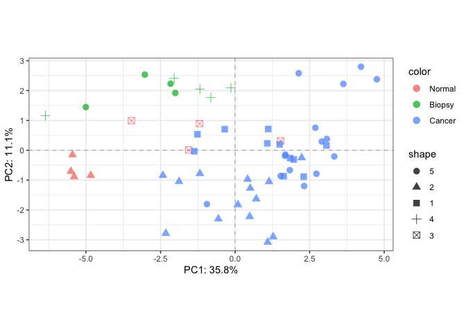

``` r

# Fit RDA
fit_rda <- rda(formula=EM~outcome,
                             data=as.data.frame(colData(SE)), scale=TRUE)

# Visualize decomposition
plotDecomposition(fit_rda, 
                                    color=SE$outcome, 
                                    shape=SE$batch,
                                    color_scale = scale_color_brewer("Cancer", palette = "Set1"),
                                    shape_scale = scale_shape("Batch"))
#> Refitting PCA...
```

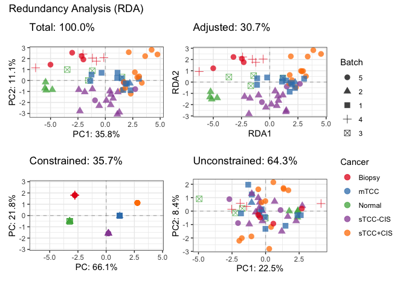

``` r

# Further inspect model
plotDesign(fit_rda, color=SE$cancer, shape=SE$batch) +
    scale_color_brewer("Cancer", palette = "Set1") +
    scale_shape("Batch")
```

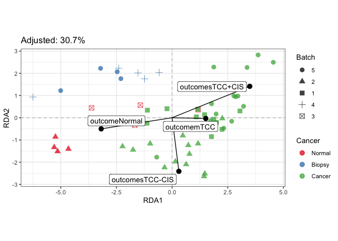

``` r

plotStrain(fit_rda, color=SE$cancer, shape=SE$batch) +
    scale_color_brewer("Cancer", palette = "Set1") +
    scale_shape("Batch")
```

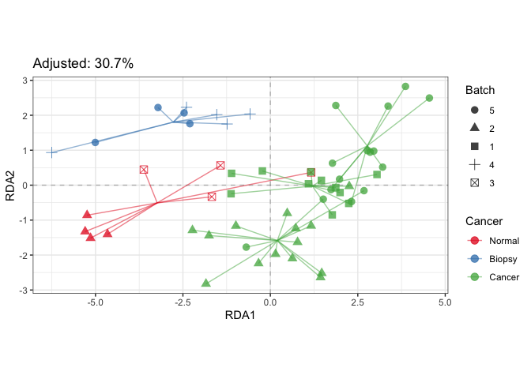

``` r

# Example of corresponding tests in vegan
anova(fit_rda, 
            permutations = how(nperm=99), # SET THIS TOO ATLEAST 999!!!
            by="term")
#> Permutation test for rda under reduced model
#> Terms added sequentially (first to last)
#> Permutation: free
#> Number of permutations: 99
#> 
#> Model: rda(formula = EM ~ outcome, data = as.data.frame(colData(SE)), scale = TRUE)
#>          Df Variance      F Pr(>F)   
#> outcome   4     7948 7.2078   0.01 **
#> Residual 52    14335                 
#> ---
#> Signif. codes:  0 '***' 0.001 '**' 0.01 '*' 0.05 '.' 0.1 ' ' 1

anova(fit_rda, 
            permutations = how(nperm=99), # SET THIS TOO ATLEAST 999!!!
            by="axis")
#> Permutation test for rda under reduced model
#> Forward tests for axes
#> Permutation: free
#> Number of permutations: 99
#> 
#> Model: rda(formula = EM ~ outcome, data = as.data.frame(colData(SE)), scale = TRUE)
#>          Df Variance       F Pr(>F)   
#> RDA1      1   5250.0 19.0445   0.01 **
#> RDA2      1   1728.9  6.2717   0.01 **
#> RDA3      1    646.9  2.3465   0.04 * 
#> RDA4      1    322.2  1.1686   0.27   
#> Residual 52  14335.0                  
#> ---
#> Signif. codes:  0 '***' 0.001 '**' 0.01 '*' 0.05 '.' 0.1 ' ' 1
```

### pRDA on parathyroidSE data

``` r
library(parathyroidSE)
data("parathyroidGenesSE")

# Filter counts using edgeR
CM <- filterCounts(~treatment*time,
                         data=colData(parathyroidGenesSE),
                         y=assay(parathyroidGenesSE))

# Normalize
EM <- normalizeCounts(CM)

# Simple PCA
fit_pca <- rda(EM, scale=TRUE)
plotTotal(fit_pca, color=parathyroidGenesSE$patient)
```

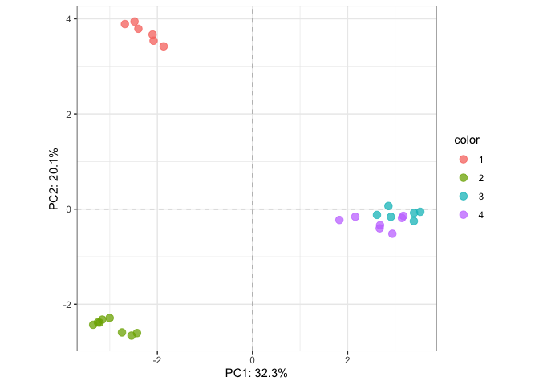

``` r

# RDA
fit_rda <- rda(formula=EM~treatment*time,
                                data=as.data.frame(colData(parathyroidGenesSE)), scale=TRUE)

# Visualize decomposition
plotDecomposition(fit_rda, color=parathyroidGenesSE$treatment, shape=parathyroidGenesSE$time,
                                    color_scale = scale_color_brewer("Treatment", palette = "Set1"),
                                    shape_scale = scale_shape("Time"))
#> Refitting PCA...
```

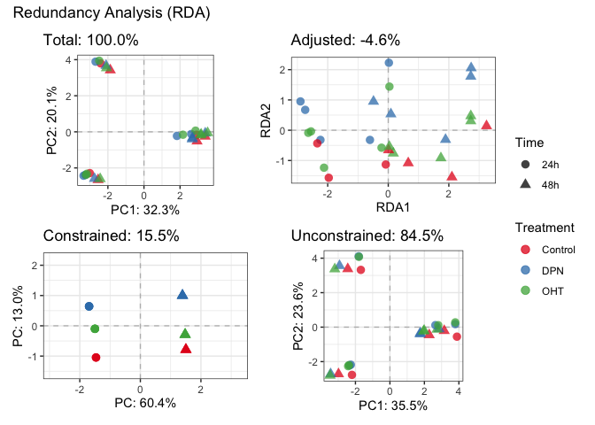

``` r

# Highligh batch effect
plotDecomposition(fit_rda, color=parathyroidGenesSE$patient,
                                    color_scale = scale_color_brewer("Patient", palette = "Set2"))
#> Refitting PCA...
```

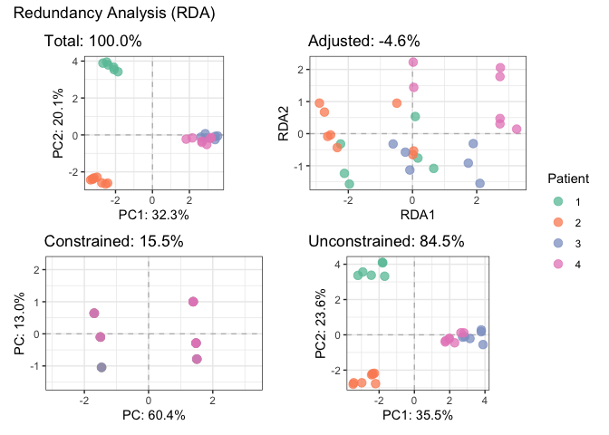

``` r

# Fit partial RDA to remove batch effect
fit_prda <- rda(formula=EM~treatment+time+treatment:time+Condition(patient),
        data=as.data.frame(colData(parathyroidGenesSE)), scale=TRUE)

# Corrected
plotDecomposition(fit_prda, color=parathyroidGenesSE$treatment, shape=parathyroidGenesSE$time,
                                    color_scale = scale_color_brewer("Treatment", palette = "Set1"),
                                    shape_scale = scale_shape("Time"))
#> Refitting PCA...
```

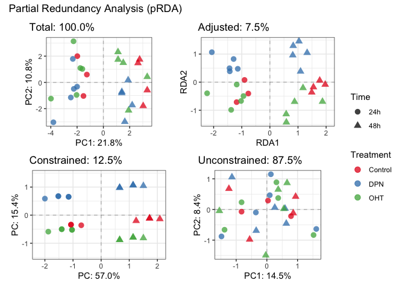

``` r
plotDecomposition(fit_prda, color=parathyroidGenesSE$patient,
                                    color_scale = scale_color_brewer("Patient", palette = "Set2"))
#> Refitting PCA...
```

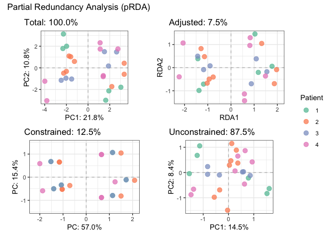

``` r

# Further introspection of pRDA
plotDesign(fit_prda, color=parathyroidGenesSE$treatment, shape=parathyroidGenesSE$time) +
    scale_color_brewer("Treatment", palette = "Set1") +
    scale_shape("Time")
```

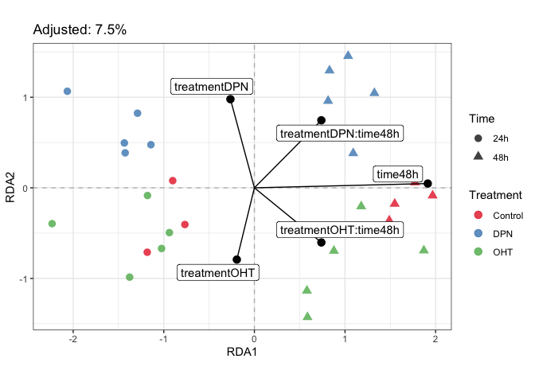

``` r

plotStrain(fit_prda, color=parathyroidGenesSE$treatment, shape=parathyroidGenesSE$time) +
    scale_color_brewer("Treatment", palette = "Set1") +
    scale_shape("Time")
```

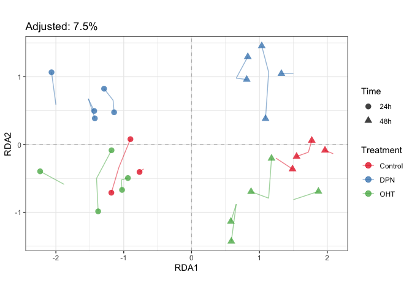

``` r

# Test significance of terms
anova(fit_prda, 
            permutations = how(nperm=99), # SET THIS TOO ATLEAST 999!!!
            by="term")
#> Permutation test for rda under reduced model
#> Terms added sequentially (first to last)
#> Permutation: free
#> Number of permutations: 99
#> 
#> Model: rda(formula = EM ~ treatment + time + treatment:time + Condition(patient), data = as.data.frame(colData(parathyroidGenesSE)), scale = TRUE)
#>                Df Variance      F Pr(>F)   
#> treatment       2    587.7 1.4934   0.07 . 
#> time            1   1122.9 5.7069   0.01 **
#> treatment:time  2    372.0 0.9452   0.55   
#> Residual       18   3541.7                 
#> ---
#> Signif. codes:  0 '***' 0.001 '**' 0.01 '*' 0.05 '.' 0.1 ' ' 1
```
